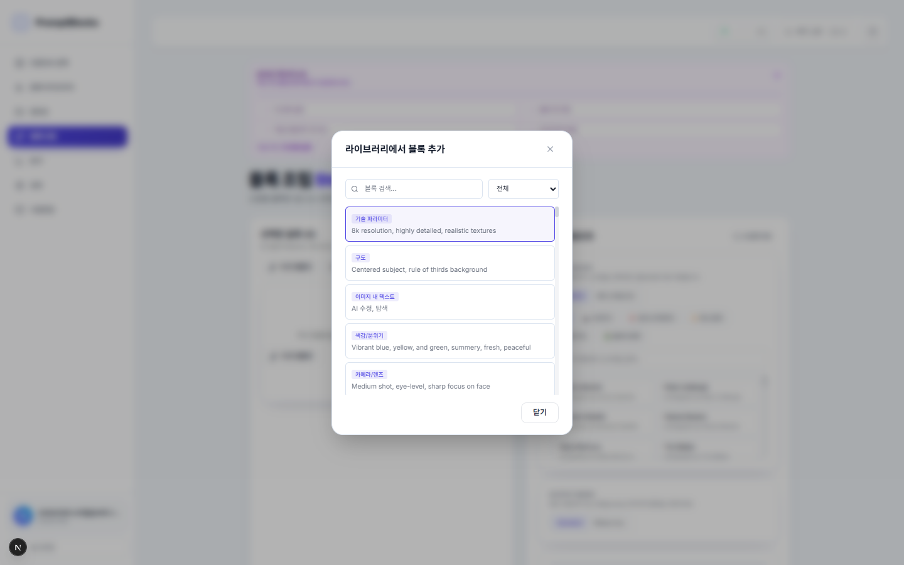
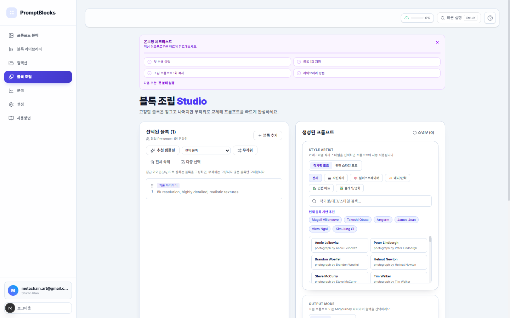
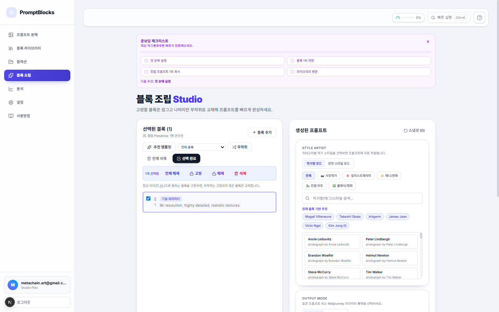

# 효과적인 프롬프트 조립하기

라이브러리의 블록을 조합하여 완성도 높은 프롬프트를 생성하는 방법을 알아봅니다.

## 개요

**Assemble**은 저장된 블록을 조합하여 새로운 프롬프트를 만드는 기능입니다. 드래그앤드롭, 잠금, 무작위 조합 등 다양한 도구를 활용할 수 있습니다.

## 전제조건

- 라이브러리에 저장된 블록
- (선택사항) 선호하는 스타일 아티스트

## 단계별 가이드

### 1. Assemble 페이지로 이동

좌측 납비게이션에서 **"Assemble"**를 클릭하세요.

### 2. 블록 추가

**"블록 추가"** 버튼 클릭:

1. 라이브러리 모달 열림
2. 원하는 블록 클릭하여 선택
3. 모달 닫기 또는 계속 추가


*라이브러리에서 원하는 블록을 선택하여 추가합니다*

### 3. 블록 순서 변경

**드래그앤드롭**으로 순서 조정:

1. 블록 좌측의 그립 아이콘(≡) 잡기
2. 원하는 위치로 드래그
3. 놓으면 순서 변경 완료

> 💡 **팁**: 프롬프트에서 앞에 올수록 중요도가 높아집니다.

### 4. 블록 잠금

**잠금 아이콘** 클릭:

- 🔒 **잠김**: 무작위 조합 시 변경되지 않음
- 🔓 **잠금 해제**: 무작위 조합 대상

> 💡 **팁**: 캐릭터 일관성을 위해 Subject Type과 Appearance 블록은 잠그세요.

### 5. 작가 스타일 추가

**스타일 아티스트 섹션**:

1. 카테고리 선택 (사진작가, 일러스트레이터 등)
2. 원하는 작가 클릭
3. 여러 작가 조합 가능

**모드 선택**:

- **작가명 모드**: "by artist name" 형식
- **안전 스타일 모드**: 카테고리 + 태그 형식


*작가 스타일을 선택하여 프롬프트에 적용합니다*

### 6. 무작위 조합

**"무작위"** 버튼 클릭:

- 잠금되지 않은 블록만 대상
- 선택된 컬렉션 범위 내에서 교체
- 같은 블록 타입 내에서만 교체

> 💡 **팁**: 창의적인 조합을 빠르게 탐색할 때 유용합니다.

### 7. 출력 모드 설정

**Output Mode**:

- **Standard**: 일반 텍스트 프롬프트
- **Midjourney**: --sref, --sw 등 파라미터 포함

### 8. 프롬프트 복사

**"복사"** 버튼 클릭:

1. 완성된 프롬프트가 클립보드에 복사
2. Midjourney/DALL-E 등에 붙여넣기
3. 히스토리에 자동 저장


*완성된 프롬프트를 클립보드에 복사합니다*

## 고급 기능

### 프리셋 저장

자주 쓰는 블록 조합 저장:

1. **"프리셋 저장"** 버튼 클릭
2. 이름 입력
3. 저장 완료

### 스냅샷 저장

현재 조립 상태 저장:

1. **"스냅샷"** 버튼 클릭
2. 이름 입력
3. 나중에 불러와서 복원 가능

### 공유 링크 생성

읽기 전용 공유:

1. **"공유"** 버튼 클릭
2. 공유 URL 생성
3. 링크 복사하여 공유


### 다중 선택 (벌크 액션)

여러 블록을 한 번에 관리:

1. **"다중 선택"** 버튼 클릭
2. 체크박스로 원하는 블록 선택
3. **고정/해제/삭제** 일괄 적용


*여러 블록을 선택하여 일괄 작업을 수행합니다*

## 팁과 모범사례

### ✅ 효과적인 프롬프트 구조

```
1. 주제 유형 (누구/무엇)
2. 외형/의상 (어떤 모습)
3. 포즈/표정 (무엇을 하는지)
4. 배경/환경 (어디에서)
5. 조명/카메라 (어떻게 촬영)
6. 스타일/색감 (어떤 느낌)
```

### ✅ 블록 선택 전략

- **핵심 블록 3-5개**: 과다한 블록은 혼란 야기
- **상호보완적 선택**: "소프트 라이팅" + "몽환적 분위기"
- **중복 피하기**: 유사한 의미의 블록 중복 사용 지양

### ⚠️ 주의사항

- **문법 확인**: 블록 조합 시 문법적 자연스러움 체크
- **길이 관리**: 너무 긴 프롬프트는 AI 처리 한계
- **호환성**: Midjourney/DALL-E별 최적화 차이

## 다음 단계

- [얼굴 일관성 유지하기](./face-consistency.md)
- [Midjourney 파라미터 사용하기](./midjourney-params.md)
- [프리셋 저장하고 공유하기](./save-share-presets.md)
